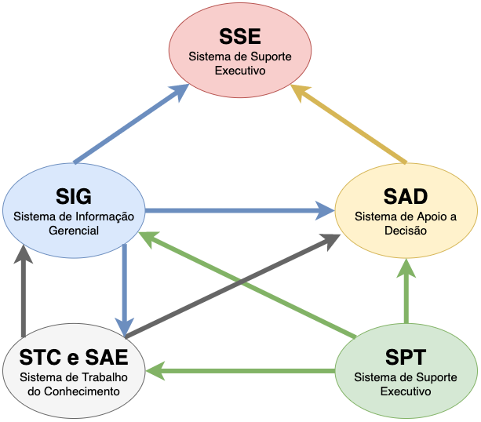
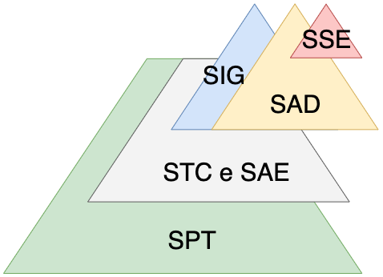

# Sistemas de Informação

## Integrantes

- Anderson Gama
- Artur Reis
- Gabriel Oliveira Silva
- João Vitor
- Tiago Brandão
- Vitor Oliveira Silva

## Parte 1

- [Introdução](#Introdução)
- [SPT's](#SPT's)
- [STC's](#STC's)
- [SAE's](#SAE's)
- [SIG's](#SIG's)
- [SAD's](#SAD's)
- [SSE's](#SSE's)

### Introdução

[Início](#Parte-1)

### SPT's

- O que são?
- Nível de atuação hierárquico
- Caracteristicas
- Entradas
- Saídas

[Início](#Parte-1)

### STC's

- O que são?
- Nível de atuação hierárquico
- Caracteristicas
- Entradas
- Saídas

[Início](#Parte-1)

### SAE's

- O que são?
- Nível de atuação hierárquico
- Caracteristicas
- Entradas
- Saídas

[Início](#Parte-1)

### SIG's

- O que são?
- Nível de atuação hierárquico
- Caracteristicas
- Entradas
- Saídas

[Início](#Parte-1)

### SAD's

Sistemas de Apoio a Decisão (SAD): SAD é um tipo de sistema que atua no nível gerencial. O SAD é uma evolução dos Sistemas Informações Gerenciais (SIG), o SAD ajuda os gerentes de nível tático a tomarem decisões mais complexas, não rotineiras. O SAD se nutre de dados originados nos Sistemas de Processamento de Transações (SPT), sistemas que atuam no nível operacional, dados do SIG e também de dados de fontes externas. O SAD lida com problemas que se alteram constantemente, portanto o seu algorítimo é elaborado para oferecer essa flexibilização de panoramas inconstantes e proporcionar uma melhor tomada de decisão, é neste cenário que atuam os dados de fontes externas. Por fim o SAD utiliza modelos de análise de dados, ou seja, modelos análiticos/estatísticos e apoio da inteligência artificial e mineração de dados. O SAD capturando um conjunto de dados do sistema de nível hierárquico inferior consegue processar e minerar os dados, gerando conhecimento útil para os gerentes de nível tático da organização. Os SADs são amplamente conhecidos como sistemas de BI(Business Intelligence), portanto os sistemas de BI são sistemas que atuam no nível intermediário da empresa, ajudando os gestores a tomarem decisões de médio a longo prazo.

[Início](#Parte-1)

### SSE's

- O que são?
- Nível de atuação hierárquico
- Caracteristicas
- Entradas
- Saídas

[Início](#Parte-1)
